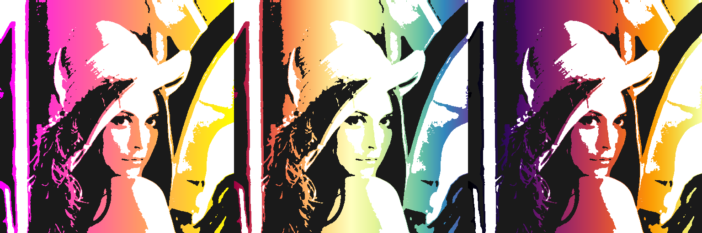

# tritonize


**tritonize** is a Python 2.7/3.6 script which allows users to convert images to a styled, minimal representation, quickly with NumPy, even on large 12MP+ images. The script uses [sigmoid](https://en.wikipedia.org/wiki/Sigmoid_function) thresholding to split a given image into 3 (or more) regions of distinct colors, and applies user-defined colors to the image instead; this transformation results in a style similar to that of the famous [Barack Obama "Hope" poster](https://en.wikipedia.org/wiki/Barack_Obama_%22Hope%22_poster).

You can also use transparent RGBA colors to make semitransparent images, which can be placed on top of a solid background or gradient like `spring`, `Spectral`, and `inferno` for even cooler effects:



The script will generate images and store them in a `tritonize` folder for each possible permutation of the given colors such that the user can choose the best result: for 3 colors, that is 6 images; for 4 colors, 24 images; for 5 colors, 120 images.

## Usage

The `tritonize` script is used from the command line:

```shell
python tritonize.py -i Lenna.png -c "#1a1a1a" "#FFFFFF" "#2c3e50" -b 10
```

```shell
python tritonize.py -i Lenna.png -c "(0, 0, 0, 0)" "(26, 26, 26, 255)" "(255, 255, 255, 255)" -b 4 -p "spring"
```

* the `-i/--image` required parameter specifies the image file.
* the `-c/--color` required parameter specified the color, followed by quote-wrapped hexidecimal, 3-element RGB, or 4-element RGBA color representations. [NB: the last RGBA parameter is scaled from 0 to 255]
* the `-b/--blur` optional parameter controls the blur strength per megapixel (default: 4)
* the `-bg/--background` optional parameter sets the background color (only relevant if any colors are transparent)
* the `-p/--palette` optional parameter sets a horizontal gradient using a palette from the matplotlib palettes (only relevant if any colors are transparent)

See the `examples` folder for more examples.

## Requirements
numpy, scipy, PIL/Pillow, matplotlib

## Todo

* Add direction changing of gradient

## Maintainer
Max Woolf ([@minimaxir](http://minimaxir.com))

## Credits
User martineau on Stack Overflow for [an easy method](http://stackoverflow.com/a/4296727) of converting color hex strings to triplets.

## License
MIT